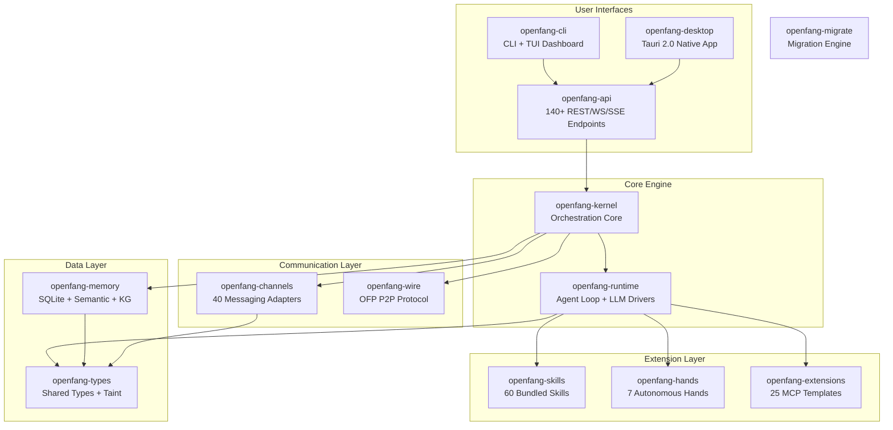
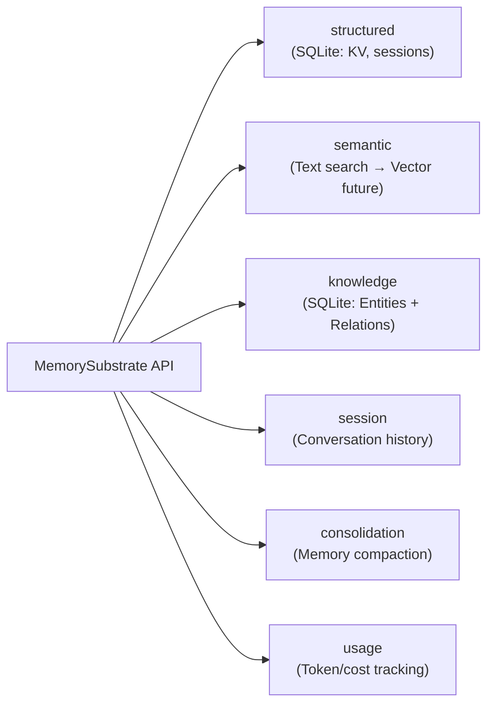
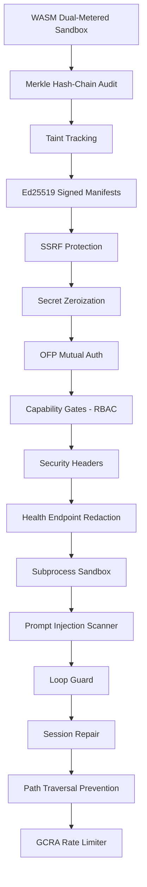
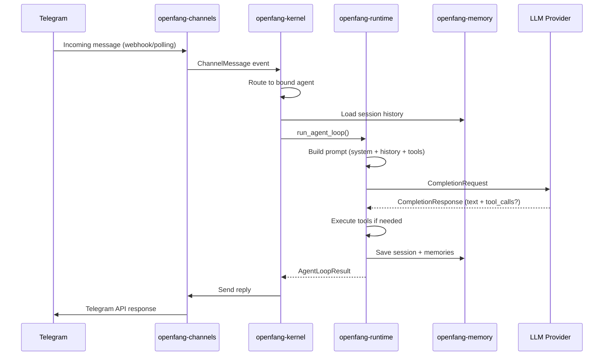
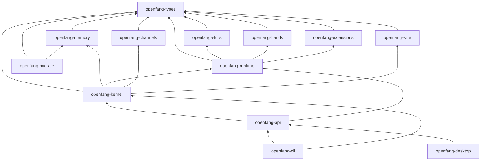

# Phân Tích Kiến Trúc Hệ Thống OpenFang

OpenFang là một **Agent Operating System** mã nguồn mở, viết hoàn toàn bằng Rust. Hệ thống biên dịch thành **1 binary duy nhất (~32MB)**, bao gồm 14 crate, 137K+ dòng code và 1,767+ test.

---

## Tổng Quan Kiến Trúc



---

## 14 Crate — Chi Tiết Từng Tầng

### 1. `openfang-types` — Foundation Layer

> Tầng nền tảng, **không chứa business logic**. Chỉ định nghĩa data structures dùng chung.

| Module | Chức năng |
|--------|-----------|
| `agent` | `AgentId`, `AgentManifest`, `AgentMode` |
| `message` | `Message`, `ContentBlock`, `ToolCall`, `TokenUsage` |
| `config` | `KernelConfig` — toàn bộ config hệ thống |
| `taint` | Information Flow taint tracking (labels propagate source→sink) |
| `manifest_signing` | Ed25519 signed agent manifests |
| `capability` | Role-based capability declarations |
| `model_catalog` | 123+ model definitions, pricing, context windows |
| `tool` | `ToolDefinition`, `ToolCall`, `ToolResult` |
| `event` | Event bus types |
| `approval` | Approval gate types |

---

### 2. `openfang-memory` — Data Persistence

> 3 storage backends hợp nhất qua 1 `MemorySubstrate` API duy nhất.



---

### 3. `openfang-kernel` — Orchestration Core (~5K LOC)

> **Trái tim của hệ thống.** Quản lý lifecycle, scheduling, permissions, và inter-agent communication.

| Module | Chức năng |
|--------|-----------|
| `kernel.rs` | `OpenFangKernel` — boot, spawn, message routing, shutdown |
| `registry.rs` | Agent registry — track tất cả agents đang chạy |
| `scheduler.rs` | Task scheduler cho workflows |
| `cron.rs` | Cron job engine (schedule-based execution) |
| `config.rs` | Config loading + validation |
| `config_reload.rs` | Hot-reload config mỗi 30s |
| `capabilities.rs` | RBAC — agents declare tools, kernel enforces |
| `auth.rs` | API key authentication |
| `approval.rs` | Approval gates cho sensitive actions |
| `supervisor.rs` | Agent supervisor (restart on crash) |
| `metering.rs` | Token/cost metering per agent |
| `event_bus.rs` | Pub/sub event bus |
| `workflow.rs` | Multi-step workflow engine |
| `triggers.rs` | Event-driven triggers |
| `background.rs` | Background agent executor |
| `heartbeat.rs` | Agent health monitoring |
| `pairing.rs` | Device pairing (mobile ↔ server) |
| `whatsapp_gateway.rs` | WhatsApp QR login bridge |

**Boot sequence:**
1. Load config (`~/.openfang/config.toml`)
2. Initialize `MemorySubstrate` (SQLite)
3. Load agent registry + skill registry
4. Start event bus + scheduler + cron
5. Spawn background agents
6. Start config hot-reload watcher

---

### 4. `openfang-runtime` — Agent Execution (~2.8K LOC agent loop)

> Nơi agent thực sự "suy nghĩ". Chạy LLM loop, gọi tools, và sandbox code.

#### Agent Loop (`agent_loop.rs`)

```
User Message
    ↓
Load Session Context + Recall Memories
    ↓
Build Prompt (system + history + tools)
    ↓
┌──────── LLM Call (with retry + fallback) ──────┐
│   ↓                                             │
│   Parse Response                                │
│   ↓                                             │
│   Tool Calls? ──Yes──→ Execute Tools (parallel) │
│       │                     ↓                   │
│       │              Append Results              │
│       │                     ↓                   │
│       └────────── Loop (max 50 iterations) ─────┘
│       │
│      No
│       ↓
│   Save Session + Update Memories
│       ↓
│   Return AgentLoopResult
└─────────────────────────────────────────────────┘
```

#### LLM Drivers

| Driver | Providers |
|--------|-----------|
| `anthropic.rs` | Anthropic (Claude) |
| `gemini.rs` | Google Gemini |
| `openai.rs` | OpenAI + 24 compatible (Groq, DeepSeek, Ollama, vLLM, etc.) |
| `fallback.rs` | Automatic failover chain |
| `copilot.rs` | Copilot integration |

Key: `LlmDriver` trait → `complete()` + `stream()` methods.

#### 53 Built-in Tools

Key categories: file I/O, web fetch, web search, shell exec, code analysis, image gen, TTS, browser automation, MCP, A2A protocol.

#### Security Subsystems in Runtime

| Module | Protection |
|--------|-----------|
| `sandbox.rs` | WASM dual-metered (fuel + epoch) |
| `subprocess_sandbox.rs` | `env_clear()` + selective passthrough |
| `loop_guard.rs` | SHA256 loop detection + circuit breaker |
| `session_repair.rs` | 7-phase message history recovery |
| `shell_bleed.rs` | Shell injection prevention |
| `auth_cooldown.rs` | Provider circuit breaker |

---

### 5. `openfang-api` — HTTP Server (Axum)

> 140+ endpoints. Dashboard SPA (Alpine.js). OpenAI-compatible API.

| Category | Endpoints | Examples |
|----------|-----------|---------|
| Agents | 20+ | CRUD, message, stream, clone, files |
| Channels | 6 | configure, test, reload, WhatsApp QR |
| Hands | 10+ | activate, pause, resume, stats |
| Skills | 5 | list, install, uninstall, create |
| Memory | 4 | KV get/set/delete per agent |
| A2A | 8 | agent card, send task, discover |
| Budget | 4 | global status, per-agent ranking |
| Audit | 2 | recent entries, Merkle verification |
| Integrations | 7 | add, remove, reconnect, health |
| OpenAI Compat | 2 | `/v1/chat/completions`, `/v1/models` |

**Middleware stack:** Auth → GCRA Rate Limiter → Security Headers → Request Logging → Compression → Tracing → CORS

---

### 6. `openfang-channels` — 40 Messaging Adapters

> Mỗi adapter convert platform messages → unified `ChannelMessage` events.

| Wave | Channels |
|------|----------|
| Core | Telegram, Discord, Slack, WhatsApp, Signal, Matrix, Email |
| Enterprise | Teams, Mattermost, Google Chat, Webex, Feishu, Zulip |
| Social | LINE, Viber, Messenger, Mastodon, Bluesky, Reddit, LinkedIn, Twitch |
| Community | IRC, XMPP, Guilded, Revolt, Keybase, Discourse, Gitter |
| Privacy + Niche | Threema, Nostr, Mumble, Nextcloud, Rocket.Chat, Ntfy, Gotify, DingTalk, Zalo, Webhooks |

Mỗi adapter hỗ trợ: per-channel model overrides, DM/group policies, rate limiting, output formatting.

---

### 7. `openfang-skills` — Skill System

> Pluggable tool bundles. 5 runtime types:

| Runtime | Execution |
|---------|-----------|
| `PromptOnly` | Inject SKILL.md vào system prompt (default) |
| `Python` | Subprocess execution |
| `Wasm` | WASM sandbox |
| `Node` | OpenClaw compatibility |
| `Builtin` | Compiled into binary |

60 bundled skills + FangHub marketplace + ClawHub compatibility.

---

### 8. `openfang-hands` — 7 Autonomous Hands

> **Core innovation.** Pre-built agents chạy tự động theo schedule, không cần prompt.

| Hand | Mô tả |
|------|-------|
| **Clip** | YouTube → vertical shorts (8-phase pipeline) |
| **Lead** | Daily lead generation + scoring 0-100 |
| **Collector** | OSINT intelligence + change detection |
| **Predictor** | Superforecasting + Brier score tracking |
| **Researcher** | Deep research + CRAAP credibility eval |
| **Twitter** | Autonomous social media management |
| **Browser** | Web automation via Playwright (purchase approval gate) |

Mỗi Hand có: `HAND.toml` manifest, system prompt, SKILL.md, guardrails, dashboard metrics.

---

### 9. `openfang-extensions` — Integration System

> 25 MCP server templates + AES-256-GCM credential vault + OAuth2 PKCE.

Categories: DevTools, Productivity, Communication, Data, Cloud, AI.

---

### 10. `openfang-wire` — P2P Protocol

> OFP (OpenFang Protocol) — agent-to-agent networking qua TCP.

- `PeerNode`: Network endpoint
- `PeerRegistry`: Known peers tracking
- `WireMessage`: JSON-RPC framed protocol
- HMAC-SHA256 mutual authentication

---

### 11-14. Supporting Crates

| Crate | Chức năng |
|-------|-----------|
| `openfang-cli` | CLI commands + TUI (ratatui) + daemon management + MCP server mode |
| `openfang-desktop` | Tauri 2.0 native app (system tray, notifications, global shortcuts) |
| `openfang-migrate` | Migration engine (OpenClaw, LangChain, AutoGPT) |
| `xtask` | Build automation |

---

## 16 Security Layers



| # | System | What It Does |
|---|--------|-------------|
| 1 | **WASM Dual-Metered Sandbox** | Tool code runs in WebAssembly with fuel metering + epoch interruption |
| 2 | **Merkle Hash-Chain Audit Trail** | Every action cryptographically linked — tamper-proof |
| 3 | **Information Flow Taint Tracking** | Labels propagate from source to sink |
| 4 | **Ed25519 Signed Agent Manifests** | Cryptographic identity signing |
| 5 | **SSRF Protection** | Block private IPs, cloud metadata, DNS rebinding |
| 6 | **Secret Zeroization** | `Zeroizing<String>` auto-wipes keys from memory |
| 7 | **OFP Mutual Authentication** | HMAC-SHA256 nonce-based P2P auth |
| 8 | **Capability Gates** | RBAC — declare required tools, kernel enforces |
| 9 | **Security Headers** | CSP, X-Frame-Options, HSTS on every response |
| 10 | **Health Endpoint Redaction** | Minimal public info, full diagnostics require auth |
| 11 | **Subprocess Sandbox** | `env_clear()` + selective passthrough |
| 12 | **Prompt Injection Scanner** | Detect override attempts and data exfil patterns |
| 13 | **Loop Guard** | SHA256 tool call loop detection + circuit breaker |
| 14 | **Session Repair** | 7-phase message history recovery |
| 15 | **Path Traversal Prevention** | Canonicalization with symlink escape prevention |
| 16 | **GCRA Rate Limiter** | Cost-aware token bucket, per-IP tracking |

---

## Data Flow — Tin Nhắn Từ Telegram → Agent → Trả Lời



---

## Cấu Trúc Thư Mục

```
openfang/
├── crates/                  # 13 Rust crates
│   ├── openfang-kernel/         # 22 source files
│   ├── openfang-runtime/        # 53 source files
│   ├── openfang-api/            # 12 source files + static/
│   ├── openfang-channels/       # 47 source files
│   ├── openfang-memory/         # 10 source files
│   ├── openfang-types/          # 19 source files
│   ├── openfang-skills/         # 69 source files
│   ├── openfang-hands/          # 18 source files
│   ├── openfang-extensions/     # 34 source files
│   ├── openfang-wire/           # 5 source files
│   ├── openfang-cli/            # 36 source files
│   ├── openfang-desktop/        # 16 source files
│   └── openfang-migrate/        # 4 source files
├── agents/                  # 30 pre-built agent profiles
├── sdk/                     # JavaScript + Python SDKs
├── packages/                # WhatsApp Gateway (Node.js)
├── scripts/                 # Install/build scripts
├── docs/                    # Documentation
├── deploy/                  # Deployment configs
└── xtask/                   # Build automation
```

---

## Dependency Graph Giữa Các Crate



---

## Key Design Patterns

| Pattern | Áp dụng |
|---------|---------|
| **Trait abstraction** | `LlmDriver`, `Memory`, `KernelHandle` — tránh circular deps |
| **Arc + DashMap** | Concurrent state sharing không cần mutex |
| **Event bus** | Pub/sub decouple kernel ↔ subsystems |
| **Config hot-reload** | Poll mỗi 30s, diff + apply changes |
| **Graceful shutdown** | SIGINT/SIGTERM + API shutdown notify |
| **Circuit breaker** | `ProviderCooldown` cho LLM rate limits |
| **Merkle audit** | Cryptographic tamper detection |
